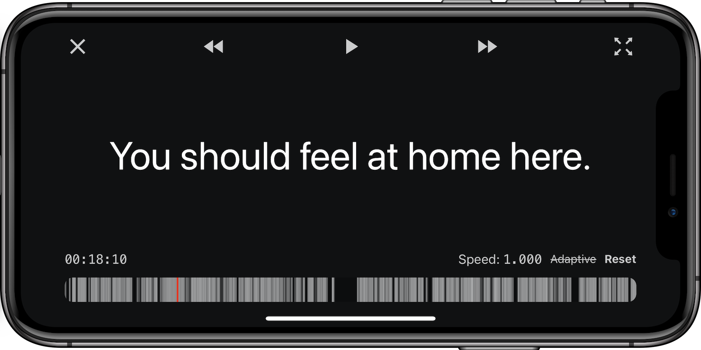

 

  

 

# Substitute

View live at [thelartians.de/substitute](https://thelartians.de/substitute).

## About

Substitute is a browser subtitle viewer, that allows you to watch subtitles from an external device, such as a smartphone or tablet. This is useful for situations where you don't have control over the video source, or want to easily adjust subtitle timings without interrupting the movie.

 

  

 

## How to use

- Find a suitable subtitle file (e.g. on [opensubtitles.org](https://opensubtitles.org))
- Load the `.srt` into [thelartians.de/substitute](https://thelartians.de/substitute) 
- Adjust the position and press play
- Adjust timing and speed as necessary

## Roadmap

- Support formatted subtitles

## Contributing

Contributions are welcome, feel free to open a PR!
For any large / breaking changes please open an issue for discussion first.
